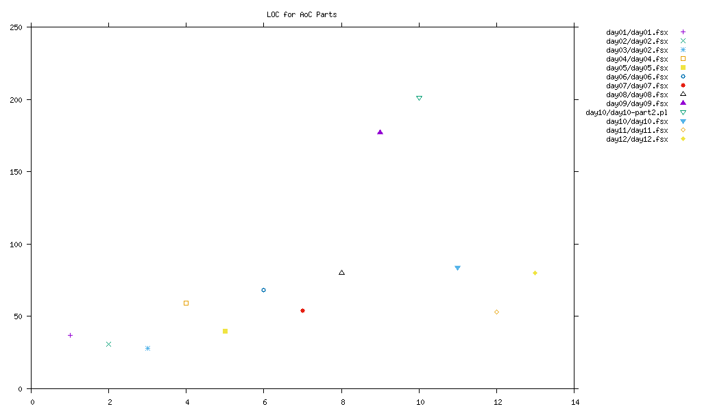

Advent Of Code 2017
===================

This is a collection of attempts at the [AoC 2017 puzzles](https://adventofcode.com/2017).

You can run each part of each day with the desired input:

```bash
day01/day01.fsx < day01/example
day01/day01.fsx < day01/input
```

Structure
---------

Each day has a directory:

```
├── day01/
├── day02/
├── day../
└── README.md
```

Each day's directory contains the example input(s), as `example` etc., and an executable script:

```
├── day../
│   ├── example
│   ├── input
│   ├── day..
│   └── README.md
└── README.md
```

Solution lengths
----------------

Here's how many lines of code it's taking me for the solutions that I've completed:


